# HealthSync Architecture Documentation

## Overview

HealthSync implements a **decentralized healthcare data exchange system** using autonomous AI agents built on the ASI Alliance technology stack. This document provides detailed architectural insights for developers, researchers, and system administrators.

## System Architecture

### High-Level Architecture

```mermaid
graph TB
    subgraph "User Interface Layer"
        PD[👤 Patient Dashboard<br/>React + TypeScript]
        RP[🔬 Researcher Portal<br/>React + TypeScript]
        AM[📊 Agent Monitor<br/>Real-time WebSocket]
        ME[🧠 MeTTa Explorer<br/>Knowledge Graph UI]
    end
    
    subgraph "API Gateway Layer"
        CP[💬 Chat Protocol<br/>ASI:One Integration]
        API[🌐 REST API<br/>FastAPI + WebSocket]
        AUTH[🔐 Authentication<br/>JWT + Role-based]
    end
    
    subgraph "Agent Orchestration Layer (Agentverse)"
        PCA[🔐 Patient Consent Agent<br/>Port 8001]
        DCA[🏥 Data Custodian Agent<br/>Port 8002]
        RQA[🔬 Research Query Agent<br/>Port 8003]
        PA[🛡️ Privacy Agent<br/>Port 8004]
        MIA[🧠 MeTTa Integration Agent<br/>Port 8005]
    end
    
    subgraph "Data & Knowledge Layer"
        MKG[📚 MeTTa Knowledge Graph<br/>Medical Ontologies]
        EHR[🏥 Mock EHR Systems<br/>FHIR Compatible]
        DS[💾 Dataset Storage<br/>Anonymized Data]
        AUDIT[📋 Audit Logs<br/>Immutable Trail]
    end
    
    %% User Interface Connections
    PD --> CP
    RP --> CP
    AM --> API
    ME --> API
    
    %% API Gateway Connections
    CP --> AUTH
    API --> AUTH
    AUTH --> PCA
    AUTH --> RQA
    
    %% Agent Interconnections
    PCA <--> DCA
    DCA <--> RQA
    RQA <--> PA
    PA <--> MIA
    
    %% Data Layer Connections
    MIA <--> MKG
    DCA <--> EHR
    PA <--> DS
    PCA --> AUDIT
    DCA --> AUDIT
    RQA --> AUDIT
    PA --> AUDIT
    MIA --> AUDIT
```



### Component Interaction Matrix

| Component | Patient Consent | Data Custodian | Research Query | Privacy | MeTTa Integration |
|-----------|----------------|----------------|----------------|---------|-------------------|
| **Patient Consent** | - | ✅ Consent Validation | ✅ Permission Checks | ❌ No Direct | ✅ Consent Storage |
| **Data Custodian** | ✅ Consent Queries | - | ✅ Data Requests | ✅ Raw Data | ❌ No Direct |
| **Research Query** | ✅ Consent Checks | ✅ Data Requests | - | ✅ Anonymization | ✅ Ethics Validation |
| **Privacy** | ❌ No Direct | ✅ Data Processing | ✅ Anonymized Results | - | ✅ Privacy Rules |
| **MeTTa Integration** | ✅ Consent Rules | ❌ No Direct | ✅ Ethics Reasoning | ✅ Privacy Policies | - |

## Agent Architecture

### Base Agent Structure

All agents inherit from a common base class that provides:

```python
class BaseAgent:
    """Base class for all HealthSync agents"""
    
    def __init__(self, name: str, port: int):
        self.name = name
        self.port = port
        self.agent = Agent(name=name, port=port)
        self.setup_protocols()
        self.setup_health_check()
        self.setup_logging()
    
    def setup_protocols(self):
        """Setup message protocols and handlers"""
        pass
    
    def setup_health_check(self):
        """Setup health check endpoint"""
        @self.agent.on_rest_get("/health")
        async def health_check():
            return {"status": "healthy", "agent": self.name}
    
    def setup_logging(self):
        """Setup structured logging"""
        pass
```

### Agent Communication Patterns

#### 1. Request-Response Pattern
```python
# Synchronous request-response for data queries
@agent.on_message(DataRequest)
async def handle_data_request(ctx: Context, sender: str, msg: DataRequest):
    # Process request
    response = await process_data_request(msg)
    # Send response
    await ctx.send(sender, DataResponse(**response))
```

#### 2. Publish-Subscribe Pattern
```python
# Asynchronous notifications for consent updates
@agent.on_message(ConsentUpdate)
async def handle_consent_update(ctx: Context, sender: str, msg: ConsentUpdate):
    # Update local state
    await update_consent_state(msg)
    # Notify interested parties
    await notify_consent_change(msg)
```

#### 3. Workflow Orchestration Pattern
```python
# Multi-step workflow coordination
async def orchestrate_research_workflow(query: ResearchQuery):
    # Step 1: Validate ethics
    ethics_result = await validate_ethics(query)
    
    # Step 2: Check consent
    consent_result = await check_consent(query)
    
    # Step 3: Retrieve data
    data_result = await retrieve_data(query)
    
    # Step 4: Anonymize
    anonymized_result = await anonymize_data(data_result)
    
    return anonymized_result
```

## Data Flow Architecture

### Research Query Workflow

```mermaid
sequenceDiagram
    participant R as 🔬 Researcher
    participant UI as 🖥️ Frontend
    participant RQA as 🔬 Research Query Agent
    participant MIA as 🧠 MeTTa Integration Agent
    participant PCA as 🔐 Patient Consent Agent
    participant DCA as 🏥 Data Custodian Agent
    participant PA as 🛡️ Privacy Agent
    
    R->>UI: Submit research query
    UI->>RQA: POST /research/query
    
    Note over RQA: Query Validation
    RQA->>RQA: Validate query structure
    RQA->>MIA: Check ethics compliance
    MIA->>MIA: Reason about ethics rules
    MIA-->>RQA: Ethics approved ✅
    
    Note over RQA: Consent Verification
    RQA->>PCA: Check patient consent
    PCA->>PCA: Query consent database
    PCA-->>RQA: Consent verified ✅
    
    Note over RQA: Data Retrieval
    RQA->>DCA: Request matching datasets
    DCA->>PCA: Verify specific permissions
    PCA-->>DCA: Permissions confirmed ✅
    DCA->>DCA: Query EHR systems
    DCA-->>RQA: Raw dataset retrieved
    
    Note over RQA: Privacy Processing
    RQA->>PA: Anonymize dataset
    PA->>MIA: Apply privacy rules
    MIA-->>PA: Privacy rules applied ✅
    PA->>PA: Apply k-anonymity (k≥5)
    PA->>PA: Add differential privacy noise
    PA-->>RQA: Anonymized dataset ready
    
    Note over RQA: Result Delivery
    RQA-->>UI: Research results
    UI-->>R: Display anonymized data 🎉
```



### Consent Management Workflow

```mermaid
sequenceDiagram
    participant P as 👤 Patient
    participant UI as 🖥️ Frontend
    participant CP as 💬 Chat Protocol
    participant PCA as 🔐 Patient Consent Agent
    participant MIA as 🧠 MeTTa Integration Agent
    participant DCA as 🏥 Data Custodian Agent
    
    P->>UI: Update consent preferences
    UI->>CP: Natural language message
    CP->>PCA: Parsed consent update
    
    Note over PCA: Consent Processing
    PCA->>PCA: Validate consent changes
    PCA->>MIA: Store consent in knowledge graph
    MIA->>MIA: Update consent relationships
    MIA-->>PCA: Consent stored ✅
    
    Note over PCA: Notification Broadcast
    PCA->>DCA: Notify consent change
    DCA->>DCA: Update access permissions
    DCA-->>PCA: Permissions updated ✅
    
    Note over PCA: Audit Trail
    PCA->>PCA: Log consent change
    PCA-->>UI: Consent update confirmed
    UI-->>P: Show updated preferences ✅
```



## Security Architecture

### Authentication & Authorization

```mermaid
graph TB
    subgraph "Authentication Layer"
        JWT[🔑 JWT Tokens<br/>Role-based Access]
        RBAC[👥 Role-Based Access Control<br/>Patient/Researcher/Admin]
        SESSION[🕐 Session Management<br/>Secure & Stateless]
    end
    
    subgraph "Authorization Matrix"
        PATIENT[👤 Patient Role<br/>- View own data<br/>- Update consent<br/>- View history]
        RESEARCHER[🔬 Researcher Role<br/>- Submit queries<br/>- View results<br/>- Export data]
        ADMIN[⚙️ Admin Role<br/>- Monitor agents<br/>- View logs<br/>- System config]
    end
    
    subgraph "Security Controls"
        TLS[🔒 TLS Encryption<br/>All Communications]
        HASH[#️⃣ Cryptographic Hashing<br/>Patient Identifiers]
        AUDIT[📋 Audit Logging<br/>All Operations]
    end
    
    JWT --> RBAC
    RBAC --> SESSION
    SESSION --> PATIENT
    SESSION --> RESEARCHER
    SESSION --> ADMIN
    
    PATIENT --> TLS
    RESEARCHER --> TLS
    ADMIN --> TLS
    
    TLS --> HASH
    TLS --> AUDIT
```



### Privacy Protection Layers

| Layer | Technique | Implementation | Purpose |
|-------|-----------|----------------|---------|
| **1. Access Control** | Role-based permissions | JWT + RBAC | Prevent unauthorized access |
| **2. Consent Enforcement** | Real-time validation | Agent communication | Respect patient preferences |
| **3. Data Anonymization** | K-anonymity (k≥5) | Privacy Agent | Group privacy protection |
| **4. Statistical Privacy** | Differential privacy | Noise injection | Individual privacy protection |
| **5. Identifier Protection** | Cryptographic hashing | SHA-256 | Prevent re-identification |
| **6. Audit Trail** | Immutable logging | Blockchain-style logs | Accountability & compliance |

## Scalability Architecture

### Horizontal Scaling Strategy

```mermaid
graph TB
    subgraph "Load Balancer Layer"
        LB[⚖️ Load Balancer<br/>NGINX/HAProxy]
    end
    
    subgraph "Agent Cluster 1"
        PCA1[🔐 Patient Consent Agent 1]
        DCA1[🏥 Data Custodian Agent 1]
        RQA1[🔬 Research Query Agent 1]
        PA1[🛡️ Privacy Agent 1]
        MIA1[🧠 MeTTa Integration Agent 1]
    end
    
    subgraph "Agent Cluster 2"
        PCA2[🔐 Patient Consent Agent 2]
        DCA2[🏥 Data Custodian Agent 2]
        RQA2[🔬 Research Query Agent 2]
        PA2[🛡️ Privacy Agent 2]
        MIA2[🧠 MeTTa Integration Agent 2]
    end
    
    subgraph "Shared Services"
        REDIS[📦 Redis Cache<br/>Session & State]
        POSTGRES[🗄️ PostgreSQL<br/>Audit & Metadata]
        METTA[🧠 MeTTa Cluster<br/>Knowledge Graph]
    end
    
    LB --> PCA1
    LB --> PCA2
    LB --> DCA1
    LB --> DCA2
    LB --> RQA1
    LB --> RQA2
    
    PCA1 --> REDIS
    PCA2 --> REDIS
    DCA1 --> POSTGRES
    DCA2 --> POSTGRES
    MIA1 --> METTA
    MIA2 --> METTA
```



### Performance Characteristics

| Component | Throughput | Latency | Scalability |
|-----------|------------|---------|-------------|
| **Patient Consent Agent** | 1000 req/sec | <50ms | Horizontal |
| **Data Custodian Agent** | 500 req/sec | <200ms | Horizontal |
| **Research Query Agent** | 100 req/sec | <2s | Horizontal |
| **Privacy Agent** | 50 req/sec | <5s | Vertical |
| **MeTTa Integration Agent** | 200 req/sec | <500ms | Horizontal |

## Deployment Architecture

### Container Architecture

```dockerfile
# Example Dockerfile for agents
FROM python:3.9-slim

WORKDIR /app
COPY requirements.txt .
RUN pip install -r requirements.txt

COPY agents/ ./agents/
COPY shared/ ./shared/
COPY config.py .

EXPOSE 8001-8005
CMD ["python", "agents/patient_consent/agent.py"]
```

### Kubernetes Deployment

```yaml
apiVersion: apps/v1
kind: Deployment
metadata:
  name: healthsync-agents
spec:
  replicas: 3
  selector:
    matchLabels:
      app: healthsync
  template:
    metadata:
      labels:
        app: healthsync
    spec:
      containers:
      - name: patient-consent-agent
        image: healthsync/patient-consent:latest
        ports:
        - containerPort: 8001
        env:
        - name: AGENT_PORT
          value: "8001"
        - name: LOG_LEVEL
          value: "INFO"
```

### Agentverse Integration

```json
{
  "manifest": {
    "name": "HealthSync Patient Consent Agent",
    "description": "Manages patient data sharing consent with granular control",
    "version": "1.0.0",
    "author": "HealthSync Team",
    "license": "MIT",
    "tags": ["healthcare", "privacy", "consent", "innovation-lab"],
    "protocols": ["chat"],
    "endpoints": {
      "health": "/health",
      "consent": "/consent",
      "chat": "/chat"
    },
    "capabilities": [
      "consent_management",
      "natural_language_processing",
      "audit_logging"
    ]
  }
}
```

## Monitoring & Observability

### Metrics Collection

```python
# Example metrics collection
from prometheus_client import Counter, Histogram, Gauge

# Agent metrics
consent_updates = Counter('consent_updates_total', 'Total consent updates')
query_processing_time = Histogram('query_processing_seconds', 'Query processing time')
active_agents = Gauge('active_agents', 'Number of active agents')

# Privacy metrics
anonymization_operations = Counter('anonymization_operations_total', 'Anonymization operations')
privacy_risk_score = Gauge('privacy_risk_score', 'Current privacy risk score')
k_anonymity_level = Gauge('k_anonymity_level', 'Current k-anonymity level')
```

### Health Check Implementation

```python
@agent.on_rest_get("/health")
async def health_check():
    """Comprehensive health check endpoint"""
    return {
        "status": "healthy",
        "agent": agent.name,
        "version": "1.0.0",
        "uptime": get_uptime(),
        "memory_usage": get_memory_usage(),
        "active_connections": get_active_connections(),
        "last_message": get_last_message_time(),
        "dependencies": {
            "metta": check_metta_connection(),
            "database": check_database_connection(),
            "other_agents": check_agent_connectivity()
        }
    }
```

## Future Architecture Considerations

### Planned Enhancements

1. **🔗 Blockchain Integration**: Immutable consent and audit trails
2. **🌐 Multi-Cloud Deployment**: Cross-cloud agent distribution
3. **🤖 Advanced AI**: Machine learning for privacy optimization
4. **📱 Mobile Agents**: Lightweight agents for mobile devices
5. **🔄 Real-time Streaming**: Event-driven architecture with Kafka

### Scalability Roadmap

- **Phase 1**: Single-region deployment (current)
- **Phase 2**: Multi-region with data replication
- **Phase 3**: Global deployment with edge computing
- **Phase 4**: Federated learning integration

This architecture provides a solid foundation for HealthSync's mission to revolutionize healthcare data sharing while maintaining the highest standards of privacy, security, and patient autonomy.